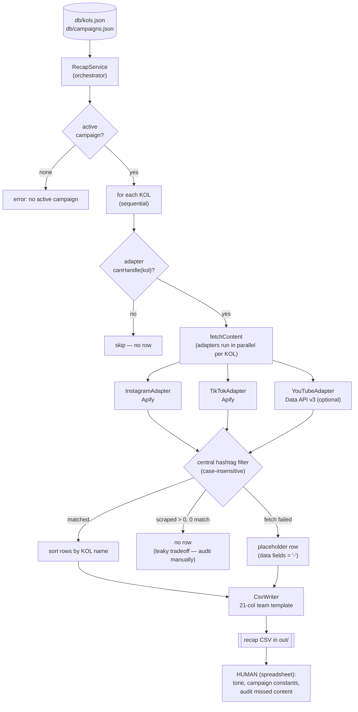

# KOL Recap Bot

A CLI + Telegram bot that pulls **public** social metrics (views, likes, comments)
for a campaign's KOLs across **Instagram, TikTok, and YouTube**, then writes a recap
**CSV in the team's 21-column template**. Manual gaps (tone, campaign constants,
platforms without a handle) are filled by hand in the exported spreadsheet.

No web UI. No LLM in the data path. Deterministic.

> Usage docs (Telegram commands, day-to-day workflow) live in
> [GUIDE_BOOK.md](./GUIDE_BOOK.md).

---

## Problem statement

I built this for someone close to me — a KOL handler at an automotive company — who
lost hours to the same chore after every campaign.

The loop, every time:

- Invite bloggers/vloggers to an event (a launch, etc.).
- KOLs create and upload content (that day or a few days later).
- Within a ~2-week cutoff, compile the recap.
- Collect the public metrics (like / comment / view) for each piece of content on
  Instagram, TikTok, and YouTube into the team's spreadsheet template.

She did it by hand — open each post, read the numbers, type them in, repeat. Dozens of
KOLs, three platforms, every campaign. No tooling.

What bugged me: those numbers are **public**. They should be trivial to read. But the
platforms gate them on purpose — that access is something they'd rather sell.

Then I nearly over-engineered it:

- **Scrape the sites directly** → walled off by antibot. Blocked, every time.
- **A fancy AI "browser agent"** that clicks around like a human → expensive, and the
  results weren't even good. I was drifting from the actual problem toward shiny tech.
- **A pretty dashboard** with charts → looked great in my head; in practice it left
  half the work still manual. Not what was needed.

The fix was boring, and that's the point. [Apify](https://apify.com) already handles
the antibot problem cheaply — I just ask it for the data. The interface is a Telegram
bot: type one command, wait, get the recap file. Near-zero cost.

Hours of manual work per campaign became a couple of minutes. This tool automates the
**finding and measuring**; the remaining human work is judgment calls (tone, campaign
constants, auditing untagged content). Not the flashiest thing I've built — but it
solves a real problem and stays out of its own way.

---

## How it works (flow)



Key ideas:

- **Snapshot, not time-series.** Run it near the cutoff; re-run if needed. There is no
  daily cron — a recap is one final number per piece of content.
- **Content is found automatically** by scraping each KOL's profile and then
  **filtering by the campaign hashtag** (central, case-insensitive, in `RecapService`).
- **The hashtag filter is leaky by design** (see [Tradeoffs](#accepted-tradeoffs)). A
  human audits each KOL after export.

---

## Architecture

Written in **TypeScript** (ESM, `strict` mode). `tsc` compiles `src/` + `db/` to
`dist/`, and the app runs the compiled JavaScript. Adapter pattern behind a single
contract, so adding a platform never touches the core.

```
kol-recap-bot/
├── tsconfig.json                    # TypeScript config (NodeNext, strict) -> dist/
├── db/                              # DATA ONLY (JSON); read/written at runtime via process.cwd()/db
│   ├── kols.json                    # real data (gitignored; copy from the .example)
│   ├── kols.example.json            # committed template
│   ├── campaigns.json               # real data (gitignored; copy from the .example)
│   └── campaigns.example.json       # committed template
├── src/
│   ├── types.ts                     # shared types; re-exports Kol/Campaign from model/
│   ├── index.ts                     # ENTRY: Telegram bot (telegraf, long-polling)
│   ├── recap/                       # recap feature (barrel per domain)
│   │   ├── index.ts                 # re-exports the builder facade (runRecap)
│   │   ├── builder/
│   │   │   ├── index.ts
│   │   │   └── recap.ts             # ENTRY + composition root: wires adapters -> service; CLI
│   │   └── service/
│   │       ├── index.ts
│   │       └── RecapService.ts      # orchestrator; central hashtag filter + sort (DIP)
│   ├── csvwriter/
│   │   ├── index.ts
│   │   └── CsvWriter.ts             # records -> CSV (21-col team template)
│   ├── model/                       # ActiveRecord data models (barrel per domain)
│   │   ├── index.ts                 # re-exports Model + all models
│   │   ├── Model.ts                 # abstract base: id/created_at, file-backed CRUD
│   │   ├── kol/
│   │   │   ├── index.ts
│   │   │   └── Kol.ts               # extends Model (+ findByIg)
│   │   └── campaign/
│   │       ├── index.ts
│   │       └── Campaign.ts          # extends Model (+ active/activate invariant)
│   └── adapter/                     # platform adapters behind one contract (OCP)
│       ├── index.ts                 # re-exports PlatformAdapter + all adapters
│       ├── PlatformAdapter.ts       # abstract contract: canHandle / fetchContent
│       ├── instagram/
│       │   ├── index.ts
│       │   └── InstagramAdapter.ts  # Apify apify/instagram-reel-scraper
│       ├── tiktok/
│       │   ├── index.ts
│       │   └── TikTokAdapter.ts     # Apify clockworks/tiktok-scraper
│       └── youtube/
│           ├── index.ts
│           └── YouTubeAdapter.ts    # YouTube Data API v3 (free, official)
├── dist/                            # compiled JS (gitignored; npm run build)
└── out/                             # generated CSVs (gitignored)
```

**Adding a platform = a new adapter subclass + one `adapters.push(...)` in
`src/recap/builder/recap.ts`.** `RecapService`, `CsvWriter`, and `src/index.ts` never change (Open/Closed
Principle). That is the whole point of the design.

### The adapter contract

Every adapter extends the abstract `PlatformAdapter` and implements
`fetchContent(kol, campaign): Promise<FetchResult>`, returning `{ diagnostic, records[] }`.
The shapes are defined in `src/types.ts`:

- **`ContentRecord`** (PRE-filter): `{ name, platform, type, handle, title, url, views,
  likes, comments, date: "YYYY-MM-DD", hashtags: string[] }`. `date` MUST be
  `YYYY-MM-DD` or the CSV blanks Release Date/Month/YEAR.
- **`FetchDiagnostic`**: `{ handle, name, platform, scraped, errored, allError,
  firstError, cost }`.
- Adapters do **not** filter by hashtag — `RecapService` does that centrally.

### Concurrency

- **KOLs are processed sequentially** — this caps concurrent Apify actor runs at
  roughly the number of adapters (~3), not KOLs × adapters, avoiding Apify
  concurrency/memory throttling as the KOL count grows.
- **Adapters within a single KOL run in parallel** — per-KOL wall time ≈ the slowest
  adapter, not the sum.

### Row behavior per KOL

- **No handle for a platform** -> skipped, no row.
- **Has a handle but the fetch fails** -> one placeholder row with data fields set to
  `-` (a visible "attempted but failed → fill manually" marker).
- **Has a handle, scraped > 0, but 0 hashtag matches** -> no row (the accepted leaky
  tradeoff; audited manually).
- One KOL's failure never crashes the run.

---

## Data model (the `db/` pattern)

Two flat JSON files in `db/` are the single source of truth (data only). Each entity is
a **class-based model** (`src/model/`) extending an abstract `Model` that provides
file-backed CRUD —
`Kol.getAll()`, `Kol.find(id)`, `new Kol({...}).save()`, `kol.delete()`,
`Campaign.findActive()`, `Campaign.activate(id)`. Every model row carries an `id` and a
`created_at`. Reads always hit disk fresh, so edits (direct or via bot commands) take
effect without a restart.

```ts
import { Kol, Campaign } from './model/index.js';

const kols = Kol.getAll();                       // read all
const kol  = new Kol({ name, ig_username }).save();  // create (auto id + created_at)
Kol.find(kol.id)?.delete();                   // delete
Campaign.activate(2);                          // update: make #2 active, others ended
```

**`db/kols.json`** — one entry per KOL:

```json
{
  "id": 1,
  "name": "Jane Rider",
  "ig_username": "janerider_demo",
  "tiktok_username": "janerider_demo",
  "youtube_channel": "janerider_demo",
  "created_at": "2026-05-20T09:00:00+07:00"
}
```

- Handles are stored **bare** (no `@`, no URL). The YouTube adapter re-adds `@` when
  the API needs it. Leave a platform field as `""` to skip that platform for this KOL.

**`db/campaigns.json`** — exactly one entry has `"isActive": true`:

```json
{
  "id": 1,
  "created_at": "2026-06-20T09:00:00+07:00",
  "name": "Demo Campaign One",
  "hashtag": "#DemoOne",
  "isActive": true,
  "started_at": "2026-06-27",
  "ended_at": null
}
```

- `hashtag` drives the central content filter. `started_at` (YYYY-MM-DD) is the scrape
  start boundary. Only one campaign may be `active` at a time (the bot enforces this).

Templates are committed as `db/kols.example.json` and `db/campaigns.example.json`. The
real files are gitignored (they hold real KOL handles) — see [Setup](#setup).

---

## Data sources

### Instagram + TikTok — Apify

Both use [Apify](https://apify.com) actors (paid, ~$0.001–0.009 per profile scrape):

- Instagram: `apify/instagram-reel-scraper`. Views come from `videoPlayCount` (the real
  number — `videoViewCount` is junk).
- TikTok: `clockworks/tiktok-scraper`. The date param is `oldestPostDateUnified` (the
  name `oldestPostDate` is silently ignored → a full, more expensive scrape).

Get a token: **Apify Console → Settings → API & Integrations → Personal API tokens.**

### YouTube — Data API v3 (free, official)

Uses the official [YouTube Data API v3](https://developers.google.com/youtube/v3) via
the global `fetch` (no SDK, no Apify). It resolves `@handle → channelId`, walks the
channel's uploads playlist, and batch-fetches video stats. **Free**, quota 10,000
units/day (our usage ~3–5 units/KOL).

Get a key: **[console.cloud.google.com](https://console.cloud.google.com) → enable
"YouTube Data API v3" → Credentials → API key.**

YouTube is **optional**: without `YOUTUBE_API_KEY` set, it is skipped and the recap
still runs on IG + TikTok.

---

## The output CSV (team template, 21 columns)

```
Kode, Tanggal Rekap, Nama Blogger/Vlogger, Domain Blog/Vlog, Source, Source Type,
Release Date, Month Entry, Title Article/Video, Link, Product, Brand, Type Content,
Tone Article, Commentar(s), View(s), Value, Name of Event, JML, ID, YEAR
```

> Column labels are kept **verbatim** (Indonesian, the original typo `Commentar(s)`
> included) because they must match the client's existing spreadsheet exactly.

- **Auto-filled:** Tanggal Rekap (run date), Nama, Domain (`@handle`), Source
  (platform), Source Type (`Reels`/`Video`/`Shorts`), Release Date (`DD/MM/YYYY` WIB),
  Month Entry (`Jun`…), Title, Link, Commentar(s), View(s), JML (=1), YEAR.
- **Blank / manual (filled in the spreadsheet):** Kode, Product, Brand, Type Content,
  Tone Article, Value, Name of Event, ID.
- Numbers are written as **raw integers** so the spreadsheet can compute on them. Rows
  are sorted by KOL name. Timestamps are UTC, bucketed to WIB (Asia/Jakarta).

---

## Setup

**Requirements:** Node.js ≥ 18 (22 LTS recommended; the Docker image uses
`node:22-alpine`). TypeScript is a dev dependency — no global install needed.

```bash
# 1. install dependencies (includes the TypeScript toolchain)
npm install

# 2. create your env file and fill in the tokens
cp .env.example .env
#    edit .env: APIFY_TOKEN, TELEGRAM_BOT_TOKEN, TELEGRAM_ALLOWED_IDS, YOUTUBE_API_KEY (optional)

# 3. create the master data files from the templates
cp db/kols.example.json db/kols.json
cp db/campaigns.example.json db/campaigns.json
#    edit them for your KOLs + campaign (or manage KOLs/campaigns later via the bot)
```

### Environment variables (`.env`)

| Variable | Required | Purpose |
| --- | --- | --- |
| `APIFY_TOKEN` | yes | Instagram + TikTok scraping (paid). |
| `TELEGRAM_BOT_TOKEN` | for the bot | From BotFather. |
| `TELEGRAM_ALLOWED_IDS` | for the bot | Comma-separated user ids allowed to use the bot. **Without it the bot refuses to start** (money guard). Find yours via `@userinfobot`. |
| `YOUTUBE_API_KEY` | optional | Enables YouTube. If empty, YouTube is skipped. |
| `DATA_DIR` | optional | Override the `db/` data folder (default: `<cwd>/db`). |
| `OUT_DIR` | optional | Override the CSV output folder (default: `<cwd>/out`). |

### Run

Development (run TypeScript directly via `tsx`, no build step):

```bash
npm run recap     # CLI: one-shot recap of the active campaign -> CSV in out/
npm run bot       # Telegram bot (long-polling)
npm run typecheck # type-check without emitting
```

Production (compile once, then run the plain JavaScript in `dist/`):

```bash
npm run build     # tsc -> dist/
npm run bot:prod  # node dist/src/index.js
npm run recap:prod
```

> Data paths (`db/`, `out/`) resolve from the **working directory**, so both the dev
> and built paths read/write the same folders regardless of where the compiled code
> lives.

---

## Deploy (Docker — always-on bot)

The bot is long-polling, so there is **no inbound port, domain, or TLS** to configure.

```bash
docker compose up -d --build   # build + start in the background
docker compose logs -f         # watch logs
docker compose down            # stop
```

The image is **multi-stage**: the build stage runs `tsc` to produce `dist/`, and the
runtime stage ships only production dependencies + the compiled JavaScript (no
TypeScript, no dev dependencies). You do not run `npm run build` yourself for Docker.

- Requires `.env` in the compose directory (secrets are passed via `env_file`, never
  baked into the image).
- **Volumes:** `./db:/app/db` **must persist** — the bot writes KOLs/campaigns there.
  `./out:/app/out` exposes generated CSVs to the host (optional).
- `restart: unless-stopped` brings the bot back after a crash or reboot.
- Deploying to another host? Carry `db/` and `.env` along — `db/` is the source of
  truth for KOLs and campaigns.

> A laptop is a poor host for an always-on bot: closing the lid sleeps the Docker VM
> and the bot stops responding. Use a small VPS (Hetzner / DigitalOcean) — the compose
> file runs there unchanged.

---

## Accepted tradeoffs

- The hashtag filter **misses** content the KOL did not tag, and may **include** a
  KOL's own non-campaign post that used the tag. Both are resolved by a human in the
  spreadsheet after export — **do not loosen the filter to "fix" an empty/short CSV
  without a deliberate decision.**
- The per-KOL diagnostic (`scraped N, errored M, matched K`) distinguishes "the filter
  is working" (scraped > 0, matched 0) from "the scrape is broken" (scraped 0 / all
  errored).
- Pinned posts are excluded (parity across platforms); a pinned current-campaign post
  is caught by the manual audit.
- YouTube Shorts detection is a duration heuristic (≤60s); Shorts of 61s–3min are
  labeled `Video` and fixed manually.
```
